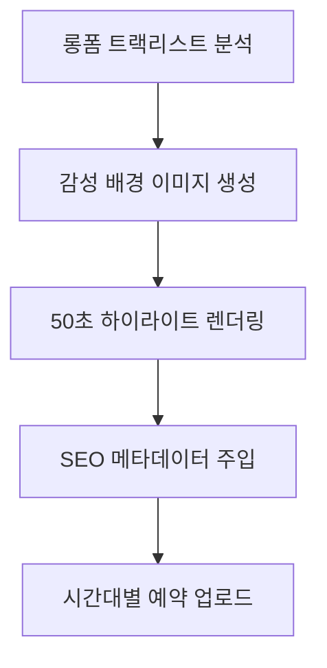

# 🎬 유튜브 쇼츠 대량 생산 및 SEO 자동화 가이드 (Melodist Seoul)

본 문서는 롱폼 플레이리스트 영상을 기반으로 고품질 쇼츠를 대량 생산하고, 이를 유튜브 채널에 최적의 시간대로 자동 예약 업로드하여 **조회수 및 구독자를 극대화하는 거미줄 마케팅 파이프라인**을 정의합니다.

---

## 📌 1. 워크플로우 요약 (Workflow)

---

## 🛠️ 2. 핵심 단계별 가이드

### ① 음원 선정 및 하이라이트 커팅
*   롱폼 영상의 트랙리스트 중 핵심 하이라이트(이탈이 적은 도입부 15~20초 이후)부터 50초간 커팅합니다.
*   **이탈 방지**: 지루한 앰비언스 구간을 스킵하여 쇼츠 시청 지속 시간을 높입니다.

### ② 비디오 렌더링 (Aesthetic Design)
*   **해상도**: 1080x1920 (9:16 세로 비율)
*   **디자인**: 감성적인 AI 생성 배경 위에 상단에는 감성 카피 문구, 하단에는 풀버전 연결을 유도하는 CTA를 배치합니다.
*   **페이드아웃**: 끝부분에 3초간 오디오 및 화면 페이드아웃을 적용해 세련미를 더합니다.

### ③ SEO 메타데이터 및 마케팅 카피
*   **태그**: `#플레이리스트 #감성음악 #카페음악 #ASMR #shorts` 등 타겟 해시태그 주입.
*   **자영업자 락인**: "본 음원은 카페, 매장 등 상업 공간에서도 저작권 침해 우려 없이 무료로 이용 가능하다"는 안내 문구를 삽입하여 평생 구독자를 유치합니다.

### ④ 스마트 예약 업로드 (Scheduling)
*   피로도가 높은 골든 타임(출근, 점심, 나른한 오후, 퇴근, 수면 전)을 타겟하여 3시간 단위로 예약 게시합니다.
*   유튜브 API의 `privacyStatus: private`와 `publishAt` 파라미터를 활용합니다.

---

## ⚙️ 3. 사용 기술 및 제약 사항

*   **엔진**: Python, MoviePy (영상/오디오 편집), Pillow (UI 구성)
*   **API 연동**: OAuth 2.0 Desktop Client (`client_secret.json`)
*   **주의 사항**: API를 통한 댓글 고정은 불가능하므로, 댓글 등록 후 수동 고정 작업이 1회 필요합니다.
