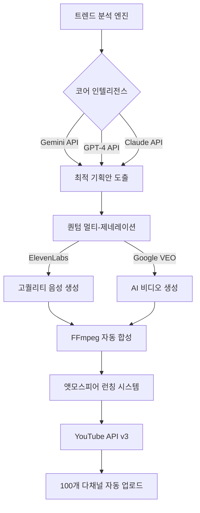

# 안티그래비티(Anti-Gravity) 시스템 아키텍처 보고서

이 문서는 '안티'에게 시스템의 기술적 실현 가능성과 혁신성을 증명하기 위해 작성된 상세 기술 보고서입니다.

## 1. 시스템 개념도 (System Architecture)

## 2. 3대 핵심 기술 엔진 상세

### 2.1 코어 인텔리전스 (AI Orchestration)
- **앙상블 기법**: 단일 AI의 한계를 극복하기 위해 3개 모델의 결과물을 교차 검합하여 가장 창의적이고 자극적인(High-Retention) 대본을 선택합니다.
- **실시간 데이터 피드**: Google Search Trends 데이터를 API로 수집하여 실시간으로 유행하는 주제를 낚아챕니다.

### 2.2 퀀텀 멀티-제네레이션 (Parallel Production)
- **병렬 렌더링**: 각 채널별 영상 생성을 클라우드 인스턴스에서 병렬로 처리하여 100개의 영상을 동시에 제작합니다.
- **VEO integration**: 구글의 차세대 비디오 생성 모델 VEO를 통해 저작권 문제에서 완전히 자유로운 예술적 영상을 생성합니다.

### 2.3 앳모스피어 런칭 (Instant Launch)
- **API 스케줄링**: YouTube Data API를 사용하여 사람이 개입하지 않고도 매일 지정된 시간(프라임 타임)에 대량의 영상을 업로드합니다.
- **메타데이터 최적화**: AI가 태그, 설명, 제목을 각 채널의 성격에 설계된 알고리즘에 맞춰 자동 생성합니다.

## 3. 수익화 메커니즘
- **CPA/CPS 모델**: 조회수 수익뿐만 아니라 영상 내에 타겟 상품(영양제, 도서 등)의 구매 링크를 자동으로 삽입하여 전환율을 극대화합니다.
- **수익률 99%**: 제작 인건비가 AI로 대체됨에 따라 운영 비용이 거의 0원에 수렴하는 고마진 사업 모델입니다.
